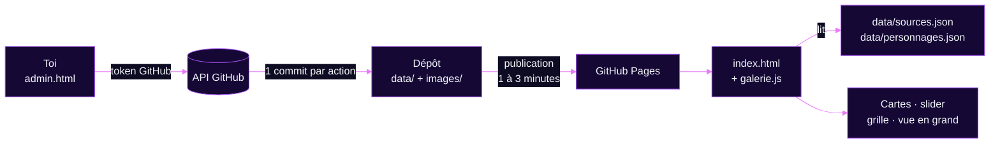
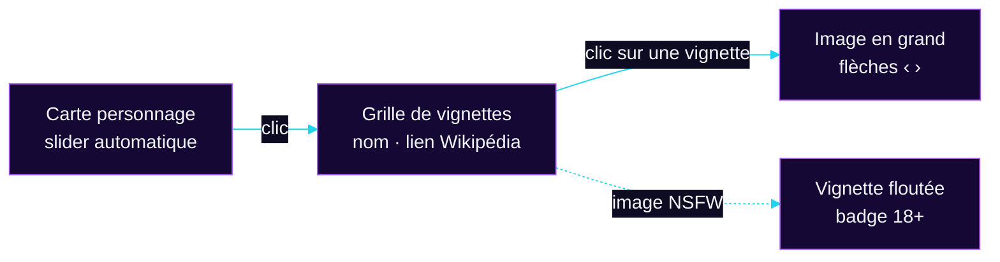

<p align="center">
  
</p>

<p align="center">
  
  
  
  
</p>

<p align="center">
  <a href="#présentation">Présentation</a> ·
  <a href="#fonctionnement">Fonctionnement</a> ·
  <a href="#structure-du-dépôt">Structure</a> ·
  <a href="#les-données">Données</a> ·
  <a href="#les-images">Images</a> ·
  <a href="#administration">Administration</a> ·
  <a href="#le-site-côté-visiteur">Côté visiteur</a> ·
  <a href="#personnalisation">Personnalisation</a> ·
  <a href="#dépannage">Dépannage</a>
</p>

> [!WARNING]
> 🔞 **Contenu NSFW — réservé aux adultes consentants.** Ce dépôt héberge une page personnelle à destination d'un public majeur uniquement.

<br>

## Présentation


Page personnelle **statique** (HTML, CSS, JavaScript, sans framework ni serveur) hébergée sur **GitHub Pages**. Elle présente quatre sections :

| Section | Contenu | Où la modifier |
|---|---|---|
| **Accueil** | Titre, pseudo, liens rapides | `index.html` (à la main) |
| **Kinks** | Liste des kinks et note importante | `index.html` (à la main) |
| **Personnages** | Cartes des personnages favoris, groupées par source | `admin.html` (interface) |
| **ERP-IRL** | Présentation et lien vers des exemples | `index.html` (à la main) |

La section **Personnages** est la seule dynamique : ses cartes ne sont plus écrites en dur dans le HTML. Elles sont construites par `galerie.js` à partir de deux fichiers de données et d'un dossier d'images, que l'on gère depuis une page d'administration (`admin.html`) sans toucher au code.

> [!TIP]
> Les images ne sont plus intégrées en base64 dans le HTML : ce sont de vrais fichiers. La page est donc beaucoup plus légère et se charge plus vite.

<br>

## Fonctionnement




1. **Tu administres** : dans `admin.html`, tu ajoutes des sources et des personnages, et tu glisses tes images.
2. **L'admin envoie** : la page envoie les fichiers directement dans ce dépôt via l'API GitHub, en **un seul commit** par action (message du type `Admin : ajout de Hatsune Miku`).
3. **GitHub Pages publie** : quelques minutes plus tard, le site est mis à jour.
4. **Le visiteur charge la page** : `galerie.js` lit `data/sources.json` et `data/personnages.json`, puis construit les cartes, le slider, la grille et la vue en grand.

Il n'y a **aucune étape de compilation** : ce que tu vois dans le dépôt est exactement ce qui est publié.

<br>

## Structure du dépôt


```text
📦 depot/
├── 📄 index.html              Page publique (accueil, kinks, personnages, ERP-IRL)
├── 🎨 galerie.css             Styles du slider, de la grille et de la vue en grand
├── ⚙️  galerie.js              Construit les cartes et gère les interactions
├── 🔐 admin.html              Interface d'administration (privée, protégée par token)
├── 🐍 extraire.py             Outil de migration unique (base64 → fichiers)
├── 📄 .pages.yml              Configuration optionnelle de Pages CMS
├── 🖼️  og_preview.jpg          Image d'aperçu (Discord, X/Twitter…)
├── 📄 README.md               Ce fichier
├── 📁 assets/                 Illustrations de ce README uniquement
│   ├── banner.svg
│   └── divider.svg
├── 📁 data/
│   ├── sources.json           Liste des sources (nom + couleur)
│   └── personnages.json       Liste des personnages (nom, source, wiki, images)
└── 📁 images/
    └── Vocaloid/                         ← une source
        └── Hatsune_Miku/                 ← un personnage
            ├── SFW/
            │   ├── Hatsune_Miku_00.png
            │   └── Hatsune_Miku_02.png
            └── NSFW/
                └── Hatsune_Miku_01.png
```

| Fichier | Rôle | À modifier à la main ? |
|---|---|---|
| `index.html` | Structure et styles de la page, sections Accueil / Kinks / ERP-IRL | Oui, pour les textes et la liste des kinks |
| `galerie.js` | Lecture des données, génération des cartes, slider, grille, flou NSFW, vue en grand | Rarement (voir [Personnalisation](#personnalisation)) |
| `galerie.css` | Apparence de la galerie | Rarement |
| `admin.html` | Création et modification des sources et des personnages | Non |
| `data/*.json` | Données du site | Non, passe par l'administration |
| `images/` | Toutes les images, rangées automatiquement | Non, passe par l'administration |
| `extraire.py` | À utiliser une seule fois pour migrer d'une ancienne version en base64 | Non |
| `.pages.yml` | Seulement si tu utilises Pages CMS | Non |

> [!NOTE]
> Les fichiers dont le nom commence par un point (`.pages.yml`) sont cachés par défaut dans l'explorateur. Sur Windows : onglet **Affichage** puis **Éléments masqués**. Sur Mac : **Cmd + Maj + point**.

<br>

## Les données


### `data/sources.json`

Une source est un univers (anime, jeu, série…). Chaque source a une couleur, utilisée pour son étiquette et le trait sous le nom de ses cartes.

```json
[
  { "name": "Vocaloid", "color": "#60a5fa" }
]
```

| Champ | Type | Règle |
|---|---|---|
| `name` | texte | Unique, sans tenir compte des majuscules. Sert aussi de nom de dossier |
| `color` | texte | Code hexadécimal à 6 caractères (`#60a5fa`). Sinon `#a855f7` est utilisé |

### `data/personnages.json`

```json
[
  {
    "name": "Hatsune Miku",
    "source": "Vocaloid",
    "wiki": "https://fr.wikipedia.org/wiki/Hatsune_Miku",
    "images": [
      { "src": "images/Vocaloid/Hatsune_Miku/SFW/Hatsune_Miku_00.png",  "nsfw": false },
      { "src": "images/Vocaloid/Hatsune_Miku/NSFW/Hatsune_Miku_01.png", "nsfw": true }
    ]
  }
]
```

| Champ | Type | Règle |
|---|---|---|
| `name` | texte | Nom affiché sur la carte |
| `source` | texte | Doit correspondre exactement à une source. Sinon le personnage est rangé sous « Autres » |
| `wiki` | texte | Lien `http(s)://` facultatif. Le bouton « Wikipédia » n'apparaît que s'il est renseigné |
| `images` | liste | Au moins une image, sinon la carte n'est pas affichée |
| `images[].src` | texte | Chemin de l'image dans le dépôt |
| `images[].nsfw` | vrai / faux | Si `true`, l'image est floutée dans la grille |

> [!IMPORTANT]
> Ces deux fichiers sont écrits par l'administration. Si tu les modifies à la main, vérifie que le JSON reste valide (virgules, guillemets), sinon la section Personnages ne s'affichera plus.

<br>

## Les images


### Rangement et nommage (automatiques)

L'administration range chaque image selon cette règle :

```text
images/{source}/{personnage}/{SFW ou NSFW}/{personnage}_{numéro}.{extension}
```

| Élément | Règle | Exemple |
|---|---|---|
| Nettoyage des noms | Accents retirés, espaces et symboles remplacés par `_` | `Éa & Côté` → `Ea_Cote` |
| Dossier SFW / NSFW | Selon la case « NSFW » cochée pour chaque image | `…/NSFW/` |
| Numéro | Commence à **00**, continue après le plus grand numéro déjà présent | `_00`, `_01`, `_02`… |
| Compteur | **Un seul par personnage**, SFW et NSFW confondus | `Miku_00` (SFW), `Miku_01` (NSFW) |
| Extension | Celle du fichier d'origine (`png`, `jpg`, `webp`, `gif`) | `.png` |

> [!NOTE]
> Un nom de source ou de personnage doit contenir au moins une lettre latine ou un chiffre. Pour un nom en japonais, écris-le en rōmaji (`Hatsune Miku` et non `初音ミク`) : le nom affiché sur la carte est le même que celui que tu saisis, mais il sert aussi à nommer les dossiers.

### Poids des images

- Coche **« Alléger les images »** dans l'administration : elles sont converties en **WebP** et limitées à **900 px de large** avant l'envoi (les GIF ne sont pas convertis).
- Sans cette option, préfère des **WebP ou JPG** d'environ 900 px de large. Évite les PNG très lourds.

<br>

## Administration


`admin.html` est une page de gestion qui modifie directement ce dépôt. Elle ne fonctionne qu'avec un **token GitHub** personnel : sans lui, la page ne permet rien.

### Première connexion

1. Ouvre `https://<ton-pseudo>.github.io/<ton-depot>/admin.html`. Le dépôt est pré-rempli automatiquement.
2. Crée un token sur [github.com/settings/personal-access-tokens/new](https://github.com/settings/personal-access-tokens/new) :
   - **Token name** : par exemple `admin site`
   - **Expiration** : la durée maximale proposée
   - **Repository access** : *Only select repositories*, puis ce dépôt uniquement
   - **Permissions → Repository permissions → Contents** : *Read and write*
3. Clique sur **Generate token**, copie-le, colle-le dans la page puis clique sur **Se connecter**.

Le token est conservé **uniquement dans ton navigateur** (`localStorage`). Le bouton **Se déconnecter** l'efface.

### Ajouter une source

1. Onglet **Sources**, carte « Nouvelle source ».
2. Saisis le nom et choisis la couleur avec le sélecteur ou en tapant le code. L'**aperçu** montre l'étiquette et le trait de carte tels qu'ils apparaîtront sur le site.
3. Clique sur **Ajouter la source**.

### Changer la couleur d'une source

Onglet **Sources**, liste « Sources existantes » : modifie la couleur (l'aperçu se met à jour en direct) puis **Enregistrer la couleur**.

### Ajouter un personnage

1. Onglet **Personnages**, carte « Nouveau personnage ».
2. Renseigne le **nom**, choisis la **source** dans la liste (pas de faute de frappe possible) et colle éventuellement le **lien Wikipédia**.
3. **Glisse toutes tes images d'un coup** dans la zone prévue, ou clique pour les choisir. Tu peux en déposer plusieurs à la fois.
4. Pour chaque miniature, coche **NSFW** si besoin. Les boutons **Tout en SFW / Tout en NSFW** aident pour un lot entier. Le **chemin final** s'affiche sous chaque image avant l'envoi.
5. Clique sur **Publier sur le site**. Tout est envoyé en un seul commit.

### Modifier un personnage

Dans « Personnages existants », clique sur **Modifier**. Tu peux :
- changer le lien Wikipédia ;
- **cocher ou décocher NSFW** sur une image déjà en ligne (le fichier est déplacé entre `SFW/` et `NSFW/`) ;
- **retirer** une image (le fichier est supprimé) ;
- **ajouter** de nouvelles images, numérotées à la suite.

### Supprimer

- **Un personnage** : bouton **Supprimer ce personnage** en mode modification. Le personnage et toutes ses images sont supprimés.
- **Une source** : bouton **Supprimer** dans l'onglet Sources. Impossible tant qu'un personnage l'utilise.

### Limites à connaître

| Limite | Pourquoi / que faire |
|---|---|
| Le **nom d'un personnage** et sa **source** ne se changent pas après création | Ils déterminent les dossiers. Pour renommer : supprime le personnage et recrée-le (les images sont à renvoyer) |
| Le **nom d'une source** ne se change pas | Même raison |
| Une modification apparaît sur le site après **1 à 3 minutes** | Délai de publication de GitHub Pages |
| Une erreur « Le dépôt a changé pendant l'envoi » | Quelqu'un (ou un autre outil) a modifié le dépôt entre-temps. Recommence |

### Sécurité

- Ne partage **jamais** ton token et ne l'écris dans aucun fichier du dépôt.
- N'utilise pas l'administration sur un ordinateur partagé sans te déconnecter ensuite.
- `admin.html` est public (comme tout fichier de GitHub Pages) mais **inutilisable sans token**. Il contient la balise `noindex` pour ne pas être référencé par les moteurs de recherche.
- Si tu penses que ton token a fuité, supprime-le dans les paramètres GitHub et crées-en un autre.

<br>

## Alternative : Pages CMS


Le fichier `.pages.yml` permet aussi d'éditer les mêmes données via [Pages CMS](https://app.pagescms.org) (connexion avec GitHub, aucun token à créer). Les deux outils modifient les mêmes fichiers.

| | `admin.html` | Pages CMS |
|---|---|---|
| Upload de plusieurs images | Oui | Oui |
| Nommage `Nom_00` automatique | **Oui** | Non |
| Rangement `source/personnage/SFW\|NSFW` | **Oui** | Non (tout dans `images/`) |
| Liste de choix pour la source | **Oui**, alimentée par les sources existantes | Texte libre |
| Aperçu de la couleur | **Oui** | Non |

Les personnages créés avec Pages CMS (images à plat dans `images/`) s'affichent normalement et restent modifiables depuis `admin.html`.

<br>

## Le site côté visiteur




| Fonctionnalité | Comportement |
|---|---|
| **Slider** | Les images d'une carte défilent toutes les 3,5 s (fondu + léger zoom). Pause au survol et au focus clavier. Ne tourne que si la carte est visible |
| **Indicateurs** | Barres de progression et badge `▦ N` sur les cartes à plusieurs images |
| **Grille** | Un clic sur la carte ouvre une fenêtre avec toutes les images, le nom et le bouton Wikipédia (masqué s'il n'y a pas de lien) |
| **Flou NSFW** | Les images marquées NSFW sont floutées dans la grille, avec un badge « 18+ » |
| **Image en grand** | Clic sur une vignette. Navigation avec les boutons ou les flèches ← →. Fermeture par clic ou **Échap**. L'image y est affichée nette |
| **Clavier et lecteurs d'écran** | Cartes et vignettes atteignables au clavier (Entrée / Espace), libellés ARIA |
| **Animations réduites** | Respecte le réglage « réduire les animations » du système : plus de défilement automatique |
| **Regroupement** | Les cartes sont groupées par source, dans l'ordre de `sources.json` |

<br>

## Personnalisation


### Palette

Définie dans `index.html` (variables CSS `:root`) :

| Variable | Couleur | Usage |
|---|---|---|
| `--bg` | `#07071a` | Fond de la page |
| `--card` | `#0e0c22` | Fond des cartes |
| `--pink` | `#e879f9` | Titres, accents |
| `--purple` | `#a855f7` | Contours, accents secondaires |
| `--cyan` | `#22d3ee` | Pseudo, liens, note importante |
| `--text` | `#f1f5f9` | Texte principal |
| `--muted` | `#64748b` | Texte secondaire |

### Réglages courants

| Je veux… | Où | Quoi |
|---|---|---|
| Changer la vitesse du slider | `galerie.js` | `AUTOPLAY_MS = 3500` (en millisecondes) |
| Agrandir / réduire les cartes | `index.html`, règle `.char-grid` | `minmax(min(240px,44vw),1fr)` : plus le nombre est grand, plus les cartes sont larges |
| Changer la forme des cartes | `galerie.css`, règle `.char-media` | `aspect-ratio:4/5` (`1/1` carré, `3/4` portrait plus haut) |
| Changer l'intensité du flou | `galerie.css`, règle `.thumb[data-nsfw] img` | `blur(14px)` |
| Modifier la liste des kinks | `index.html`, bloc `.kinks-grid` | Un `<div class="kink">…</div>` par élément |
| Mettre le lien ERP-IRL | `index.html`, bouton `.erp-btn` | Remplacer `href="link"` par l'adresse voulue |
| Changer l'image d'aperçu | `og_preview.jpg` | Remplacer le fichier (1200 × 630 px conseillé) |

<br>

## Migration depuis l'ancienne version (base64)


À faire **une seule fois**, uniquement si des personnages sont encore intégrés en base64 dans un ancien `index.html`.

1. Mets l'ancien `index.html` et `extraire.py` dans le même dossier sur ton ordinateur.
2. Lance `python extraire.py index.html` (ou ajoute `--webp` après `pip install pillow` pour convertir en WebP léger).
3. Le script crée `images/`, `data/sources.json` et `data/personnages.json`.
4. Envoie ces dossiers sur le dépôt, puis remplace l'ancien `index.html` par le nouveau.

> [!CAUTION]
> N'envoie pas des dossiers `data/` et `images/` **vides** par-dessus un site qui contient déjà des personnages : ils écraseraient les données existantes.

<br>

## Développement en local


Le navigateur bloque la lecture des fichiers JSON quand la page est ouverte par double-clic (`file://`). Pour tester chez toi :

```bash
python -m http.server 8000
```

puis ouvre <http://localhost:8000>. Tout fonctionne comme en ligne (`admin.html` aussi, il parle directement à GitHub).

<br>

## Dépannage


| Symptôme | Cause probable | Solution |
|---|---|---|
| La section Personnages est vide | `data/*.json` vides, ou JSON invalide | Ajoute un personnage via l'administration. Ouvre la console du navigateur (F12) pour voir l'erreur |
| « Les personnages ne peuvent pas être chargés » | Page ouverte en `file://`, ou fichier JSON introuvable | Utilise le serveur local ou le site publié. Vérifie que `data/` existe |
| Un personnage est sous « Autres » | Sa `source` ne correspond à aucune source | Crée la source, ou corrige-la. Via l'admin, la liste de choix évite ce cas |
| Une carte n'apparaît pas | Pas de nom ou aucune image | Ajoute au moins une image |
| Une image ne s'affiche pas (404) | Majuscules différentes dans le chemin (`.PNG` ≠ `.png`), ou publication en cours | Corrige le nom, patiente 1 à 3 minutes |
| Ancienne version affichée | Cache du navigateur ou publication en cours | **Ctrl + F5** (Mac : **Cmd + Maj + R**). Onglet **Actions** du dépôt : vérifie que la publication est terminée |
| Token refusé (erreur 401) | Token mal copié ou expiré | Recrée un token |
| Accès refusé ou dépôt introuvable (403 / 404) | Mauvais nom de dépôt ou de branche, ou permission manquante | Vérifie `utilisateur/dépôt`, la branche, et **Contents : Read and write** |
| « Le dépôt a changé pendant l'envoi » | Modification simultanée (autre onglet, Pages CMS…) | Recommence |
| « Le nom doit contenir au moins une lettre » | Nom uniquement en caractères non latins | Écris-le en rōmaji |
| Les images déjà publiées n'apparaissent pas dans l'admin juste après l'envoi | Le site n'est pas encore republié | Attends quelques minutes puis recharge |

<br>

## Aide-mémoire


| Je veux… | Je fais… |
|---|---|
| Ajouter un univers | `admin.html` → **Sources** → Nouvelle source |
| Ajouter un personnage | `admin.html` → **Personnages** → glisser les images → **Publier** |
| Flouter une image | Cocher **NSFW** sur sa miniature |
| Passer une image existante en NSFW | **Modifier** le personnage → cocher NSFW → **Enregistrer** |
| Supprimer une image | **Modifier** → **Retirer** → **Enregistrer** |
| Changer une couleur | **Sources** → modifier la couleur → **Enregistrer la couleur** |
| Changer un texte de la page | Modifier `index.html` sur GitHub |
| Voir mes changements en ligne | Attendre 1 à 3 minutes, puis **Ctrl + F5** |

<br>

<p align="center">
  <sub><b>Neku</b> · @Nathanfurry_lax · Contenu NSFW</sub>
</p>
