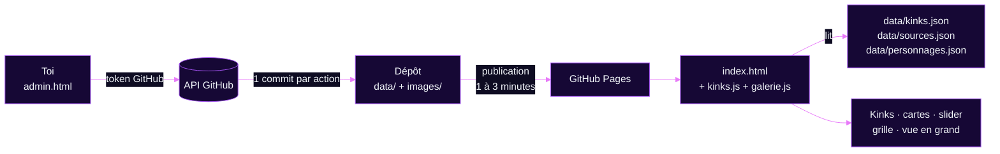
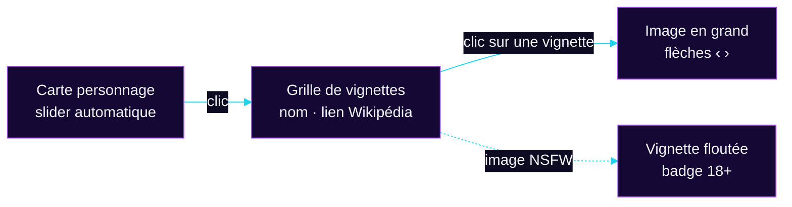

<p align="center">
  
</p>

<p align="center">
  
  
  
  
</p>

<p align="center">
  <a href="#-présentation">Présentation</a> ·
  <a href="#-fonctionnement">Fonctionnement</a> ·
  <a href="#-structure-du-dépôt">Structure</a> ·
  <a href="#-organisation-du-dépôt">Organisation</a> ·
  <a href="#-les-données">Données</a> ·
  <a href="#-les-images">Images</a> ·
  <a href="#-administration">Administration</a> ·
  <a href="#-alternative--pages-cms">Pages CMS</a> ·
  <a href="#-le-site-côté-visiteur">Côté visiteur</a> ·
  <a href="#-personnalisation">Personnalisation</a> ·
  <a href="#-migration-depuis-lancienne-version-base64">Migration</a> ·
  <a href="#-développement-en-local">En local</a> ·
  <a href="#-dépannage">Dépannage</a> ·
  <a href="#-aide-mémoire">Aide-mémoire</a>
</p>

---

> [!WARNING]
> 🔞 **Contenu NSFW — réservé aux adultes consentants (18+).**
> Ce dépôt héberge une page personnelle à destination d'un public majeur uniquement.

<br>

## 📌 Présentation


Page personnelle **statique** (HTML, CSS et JavaScript, sans framework ni serveur) hébergée gratuitement sur **GitHub Pages**. Elle présente quatre sections :

| Section | Contenu | Où la modifier |
| :--- | :--- | :--- |
| **Accueil** | Titre, pseudo, liens rapides | `index.html` (à la main) |
| **Kinks** | Liste des kinks (modifiable) et note importante | Liste : `admin.html`, onglet **Kinks**. Textes : `index.html` |
| **Personnages** | Cartes des personnages favoris, groupées par source | `admin.html`, onglet **Personnages** |
| **ERP-IRL** | Présentation et lien vers des exemples | `index.html` (à la main) |

Les sections **Kinks** et **Personnages** sont **dynamiques** : leur contenu n'est plus écrit en dur dans le HTML.

- **`kinks.js`** affiche la liste des kinks à partir de `data/kinks.json`.
- **`galerie.js`** construit les cartes, le slider, la grille et la vue en grand à partir de `data/sources.json`, `data/personnages.json` et du dossier `images/`.
- **`admin.html`** permet de tout gérer sans toucher au code.

> [!TIP]
> Les images ne sont plus intégrées en base64 dans le HTML : ce sont de vrais fichiers. La page est donc plus légère et se charge plus vite.

<br>

## ⚡ Fonctionnement




1. **Tu administres** : dans `admin.html`, tu gères les sources, les personnages, les kinks et tes images.
2. **L'admin envoie** : la page envoie les fichiers directement dans ce dépôt via l'API GitHub, en **un seul commit** par action (message du type `Admin : ajout de Hatsune Miku`).
3. **GitHub Pages publie** : 1 à 3 minutes plus tard, le site est mis à jour.
4. **Le visiteur charge la page** : `kinks.js` et `galerie.js` lisent les fichiers de `data/` et construisent l'affichage.

> [!NOTE]
> Il n'y a **aucune étape de compilation** : ce que tu vois dans le dépôt est exactement ce qui est publié.

<br>

## 📂 Structure du dépôt


```text
📦 depot/
├── 📄 index.html              Page publique (accueil, kinks, personnages, ERP-IRL)
├── 🎨 galerie.css             Styles du slider, de la grille et de la vue en grand
├── 🎨 animations.css          Styles des animations (entrée du hero, effets néon…)
├── ⚙️  galerie.js             Construit les cartes et gère les interactions
├── ⚙️  kinks.js               Affiche la liste des kinks depuis data/kinks.json
├── ✨ animations.js           Animations : révélation au scroll, pétales, progression…
├── 🔐 admin.html              Interface d'administration (protégée par token)
├── 🐍 extraire.py             Outil de migration à usage unique (base64 → fichiers)
├── 📄 .pages.yml              Configuration facultative de Pages CMS
├── 🖼️  og_preview.jpg         Image d'aperçu (Discord, X/Twitter…)
├── 📄 LICENSE                 Licence du dépôt
├── 📄 README.md               Ce fichier
├── 📁 assets/                 Illustrations de ce README uniquement
│   ├── banner.svg
│   └── divider.svg
├── 📁 data/
│   ├── kinks.json             Liste des kinks
│   ├── sources.json           Liste des sources (nom + couleur)
│   └── personnages.json       Liste des personnages (nom, source, wiki, images)
└── 📁 images/
    ├── placeholder.webp                  Image par défaut « Image à venir »
    └── Vocaloid/                         Une source
        └── Hatsune_Miku/                 Un personnage
            ├── SFW/
            │   ├── Hatsune_Miku_00.png
            │   └── Hatsune_Miku_02.png
            └── NSFW/
                └── Hatsune_Miku_01.png
```

| Fichier | Rôle | À modifier à la main ? |
| :--- | :--- | :--- |
| `index.html` | Structure et styles de la page, sections Accueil, Kinks (textes) et ERP-IRL | **Oui**, pour les textes |
| `kinks.js` | Lecture de `data/kinks.json` et affichage des kinks | Rarement |
| `galerie.js` | Cartes, slider, grille, flou NSFW, vue en grand, image par défaut | Rarement (voir [Personnalisation](#-personnalisation)) |
| `galerie.css` | Apparence de la galerie | Rarement |
| `animations.js` / `animations.css` | Animations de la page | Rarement, pour régler ou désactiver un effet |
| `admin.html` | Gestion des sources, personnages, kinks et fichiers | Non |
| `data/*.json` | Données du site | Non, passe par l'administration |
| `images/` | Toutes les images, rangées automatiquement | Non, passe par l'administration |
| `extraire.py` | Migration unique depuis une ancienne version en base64 | Non (peut être supprimé ensuite) |
| `.pages.yml` | Uniquement si tu utilises Pages CMS | Non |

> [!NOTE]
> Les fichiers dont le nom commence par un point (`.pages.yml`) sont cachés par défaut dans l'explorateur. Sur Windows : onglet **Affichage** puis **Éléments masqués**. Sur Mac : **Cmd + Maj + point**.

<br>

## 🔧 Organisation du dépôt


| À quoi je touche | Comment |
| :--- | :--- |
| `data/` et `images/` | **Jamais à la main** : tout passe par `admin.html` (ou Pages CMS) |
| `index.html`, `galerie.*`, `kinks.js`, `animations.*`, `admin.html` | Fichiers du site : à remplacer quand je reçois une mise à jour |
| `assets/`, `README.md`, `LICENSE`, `og_preview.jpg` | Fichiers annexes : à laisser tels quels |
| `extraire.py` | Peut être supprimé une fois les personnages migrés |

> [!CAUTION]
> **Ne téléverse jamais** un dossier `data/` ou `images/` complet par-dessus un site en ligne : il écraserait tes données. Pour une mise à jour, envoie uniquement les fichiers modifiés.

- Ne dépose pas d'images directement dans `images/` via GitHub : utilise l'administration, qui les nomme et les range toute seule. Les fichiers déposés à la main deviennent des fichiers inutilisés.
- Un envoi en double sur GitHub crée des fichiers du type `nom (1).webp` : supprime-les avec l'onglet **Fichiers** de l'administration.

<br>

## 📊 Les données


### `data/kinks.json`

La liste des kinks affichés dans la section **Kinks**, dans l'ordre d'affichage.

```json
[
  { "name": "kink1" },
  { "name": "Kink2" },
  { "name": "Kink3" }
]
```

| Règle | Détail |
| :--- | :--- |
| Format | Une liste d'objets `{ "name": "…" }`. Une ancienne liste de simples textes est aussi lue, et convertie à la prochaine publication depuis l'administration |
| Longueur | 30 caractères maximum par nom dans l'administration |
| Doublons | Refusés (sans tenir compte des majuscules) |
| Affichage | Les noms apparaissent en majuscules sur le site (effet du style, pas du texte saisi) |

### `data/sources.json`

Une source est un univers (anime, jeu, série…). Sa couleur sert pour son étiquette et le trait sous le nom de ses cartes.

```json
[
  {
    "name": "Vocaloid", 
    "color": "#60a5fa" 
  }
]
```

| Champ | Type | Règle |
| :--- | :--- | :--- |
| `name` | texte | Unique, sans tenir compte des majuscules. Sert aussi de nom de dossier |
| `color` | texte | Code hexadécimal à 6 caractères (`#60a5fa`). Sinon `#a855f7` est utilisé |

### `data/personnages.json`

```json
[
  {
    "name": "Hatsune Miku",
    "source": "Vocaloid",
    "wiki": "https://fr.wikipedia.org/wiki/Hatsune_Miku",
    "images": [
      { 
        "src": "images/Vocaloid/Hatsune_Miku/SFW/Hatsune_Miku_00.png",  
        "nsfw": false 
      },
      { 
        "src": "images/Vocaloid/Hatsune_Miku/NSFW/Hatsune_Miku_01.png", 
        "nsfw": true 
      }
    ]
  }
]
```

| Champ | Type | Règle |
| :--- | :--- | :--- |
| `name` | texte | Nom affiché sur la carte |
| `source` | texte | Doit correspondre exactement à une source. Sinon le personnage est rangé sous « Autres » |
| `wiki` | texte | Lien `http(s)://` facultatif. Le bouton « Wikipédia » n'apparaît que s'il est renseigné |
| `images` | liste | Peut être vide : la carte affiche alors l'image par défaut `images/placeholder.webp` (« Image à venir ») et n'ouvre pas de grille |
| `images[].src` | texte | Chemin de l'image dans le dépôt |
| `images[].nsfw` | true / false | Si `true`, l'image est floutée dans la grille |

> [!IMPORTANT]
> Ces fichiers sont écrits par l'administration. Si tu les modifies à la main, vérifie que le JSON reste valide (virgules, guillemets), sinon la section concernée ne s'affichera plus.

<br>

## 📸 Les images


### Rangement et nommage (automatiques)

L'administration range chaque image selon cette règle :

```text
images/{source}/{personnage}/{SFW ou NSFW}/{personnage}_{numéro}.{extension}
```

Exemple : `images/Vocaloid/Hatsune_Miku/SFW/Hatsune_Miku_00.png`

| Élément | Règle | Exemple |
| :--- | :--- | :--- |
| Nettoyage des noms | Accents retirés, espaces et symboles remplacés par `_` | `Éa & Côté` → `Ea_Cote` |
| Dossier SFW / NSFW | Selon la case « NSFW » cochée pour chaque image | `…/NSFW/` |
| Numéro | Commence à **00**, continue après le plus grand numéro déjà présent | `_00`, `_01`, `_02`… |
| Compteur | **Un seul par personnage**, SFW et NSFW confondus | `Miku_00` (SFW), `Miku_01` (NSFW) |
| Extension | Celle du fichier d'origine (`png`, `jpg`, `webp`, `gif`) | `.png` |

> [!NOTE]
> Un nom de source ou de personnage doit contenir au moins une lettre latine ou un chiffre. Pour un nom en japonais, écris-le en rōmaji (`Hatsune Miku` et non `初音ミク`) : il sert aussi à nommer les dossiers.

### Image par défaut « Image à venir »

`images/placeholder.webp` s'affiche pour tout personnage qui n'a **pas encore d'image** : la carte n'a ni slider ni grille, et un clic dessus n'ouvre rien. Dans l'administration, tu peux enregistrer un personnage sans image (une confirmation est demandée). Pour changer cette image, remplace le fichier en gardant le même nom (format portrait 4/5 conseillé, par exemple 800 × 1000 px).

### Poids des images

- Coche **« Alléger les images »** dans l'administration : elles sont converties en **WebP** et limitées à **900 px de large** avant l'envoi (les GIF ne sont pas convertis).
- Sans cette option, préfère des **WebP ou JPG** d'environ 900 px de large. Évite les PNG très lourds.

<br>

## 🔐 Administration


`admin.html` est une page de gestion qui modifie directement ce dépôt, sans serveur. Elle ne fonctionne qu'avec un **token GitHub** personnel : sans lui, elle ne permet rien. Quatre onglets : **Personnages**, **Sources**, **Kinks** et **Fichiers**.

### Première connexion

1. Ouvre `https://<ton-pseudo>.github.io/<ton-depot>/admin.html`. Le dépôt est pré-rempli automatiquement.
2. Crée un token sur [github.com/settings/personal-access-tokens/new](https://github.com/settings/personal-access-tokens/new) :
   - **Token name** : par exemple `admin site`
   - **Expiration** : la durée maximale proposée
   - **Repository access** : *Only select repositories*, puis ce dépôt uniquement
   - **Permissions → Repository permissions → Contents** : *Read and write*
3. Clique sur **Generate token**, copie-le, colle-le dans la page puis clique sur **Se connecter**.

Le token est conservé **uniquement dans ton navigateur** (`localStorage`). Le bouton **Se déconnecter** l'efface.

### Ajouter une source

1. Onglet **Sources**, carte « Nouvelle source ».
2. Saisis le nom et choisis la couleur avec le sélecteur ou en tapant le code. L'**aperçu** montre l'étiquette et le trait de carte tels qu'ils apparaîtront sur le site.
3. Clique sur **Ajouter la source**.

Pour changer la couleur d'une source existante : onglet **Sources**, liste « Sources existantes », modifie la couleur (aperçu en direct) puis **Enregistrer**.

### Ajouter un personnage

1. Onglet **Personnages**, carte « Nouveau personnage ».
2. Renseigne le **nom**, choisis la **source** dans la liste (pas de faute de frappe possible) et colle éventuellement le **lien Wikipédia**.
3. **Glisse toutes tes images d'un coup** dans la zone prévue, ou clique pour les choisir.
4. Pour chaque miniature, coche **NSFW** si besoin. Les boutons **Tout en SFW / Tout en NSFW** aident pour un lot entier. Le **chemin final** s'affiche sous chaque image avant l'envoi.
5. Clique sur **Publier sur le site**. Tout est envoyé en un seul commit.

### Modifier un personnage

Dans « Personnages existants », clique sur **Modifier**. Tu peux :

- changer le lien Wikipédia ;
- **cocher ou décocher NSFW** sur une image déjà en ligne (le fichier est déplacé entre `SFW/` et `NSFW/`) ;
- **retirer** une image (le fichier est supprimé) ;
- **ajouter** de nouvelles images, numérotées à la suite.

### Modifier les kinks

Onglet **Kinks** : la liste complète s'affiche, avec un **aperçu** identique au rendu du site.

- **Renommer** : modifie directement le texte dans le champ.
- **Réordonner** : flèches ↑ ↓ à droite de chaque ligne.
- **Supprimer** : icône poubelle.
- **Ajouter** : saisis le nom dans « Ajouter un kink » puis **Ajouter** (ou touche Entrée).

Rien n'est publié tant que tu n'as pas cliqué sur **Publier sur le site**. Le bandeau « Modifications non publiées » te le rappelle, **Annuler les changements** revient à la liste en ligne, et le navigateur te prévient si tu quittes la page avec des changements non publiés. Une confirmation est demandée si tu publies une liste vide.

### Faire le ménage : onglet Fichiers

L'onglet **Fichiers** repère les images du dossier `images/` qui ne sont utilisées par **aucun personnage** (doublons, essais, anciennes images). Chaque fichier est affiché avec une miniature, son chemin et son poids.

1. Coche les fichiers à supprimer (ou **Tout cocher**).
2. Clique sur **Supprimer la sélection** et confirme.

L'image par défaut `images/placeholder.*` et les fichiers `.gitkeep` ne sont **jamais** proposés. Une seconde carte, **Images introuvables**, liste les personnages qui pointent vers un fichier absent du dépôt.

### Supprimer

- **Un personnage** : bouton **Supprimer ce personnage** en mode modification. Le personnage et toutes ses images sont supprimés.
- **Une source** : bouton **Supprimer** dans l'onglet Sources. Impossible tant qu'un personnage l'utilise.

### Limites à connaître

| Limite | Pourquoi / que faire |
| :--- | :--- |
| Le **nom d'un personnage** et sa **source** ne se changent pas après création | Ils déterminent les dossiers. Pour renommer : supprime le personnage et recrée-le (les images sont à renvoyer) |
| Le **nom d'une source** ne se change pas | Même raison |
| Une modification apparaît sur le site après **1 à 3 minutes** | Délai de publication de GitHub Pages |
| Erreur « Le dépôt a changé pendant l'envoi » | Le dépôt a été modifié entre-temps (autre onglet, autre outil). Recommence |

> [!IMPORTANT]
> **Sécurité.** Ne partage jamais ton token et ne l'écris dans aucun fichier du dépôt. Déconnecte-toi après usage sur un ordinateur partagé. `admin.html` est public (comme tout fichier de GitHub Pages) mais **inutilisable sans token** ; il contient la balise `noindex` pour ne pas être référencé. Si tu penses que ton token a fuité, supprime-le dans les paramètres GitHub et crées-en un autre.

<br>

## 📑 Alternative : Pages CMS


Le fichier `.pages.yml` permet aussi d'éditer les **kinks**, les **sources** et les **personnages** via [Pages CMS](https://app.pagescms.org) (connexion avec GitHub, aucun token à créer). Les deux outils modifient les mêmes fichiers.

| | `admin.html` | Pages CMS |
| :--- | :--- | :---  |
| Connexion | Token GitHub | Compte GitHub |
| Upload de plusieurs images | ✅| ✅|
| Nommage `Nom_00` automatique | **✅** | :x: |
| Rangement `source/personnage/SFW ou NSFW` | **✅** | :x: (tout dans `images/`) |
| Liste de choix pour la source | **✅**, alimentée par les sources existantes | Texte libre |
| Aperçu de la couleur | **✅** | :x: |
| Nettoyage des fichiers inutilisés | **✅** | :x: |

Les personnages créés avec Pages CMS (images à plat dans `images/`) s'affichent normalement et restent modifiables depuis `admin.html`.

<br>

## 👀 Le site côté visiteur




| Fonctionnalité | Comportement |
| :--- | :--- |
| **Slider** | Les images d'une carte défilent toutes les 3,5 s (fondu + léger zoom). Pause au survol et au focus clavier. Ne tourne que si la carte est visible |
| **Indicateurs** | Barres de progression et badge `▦ N` sur les cartes à plusieurs images |
| **Grille** | Un clic sur la carte ouvre une fenêtre avec toutes les images, le nom et le bouton Wikipédia (masqué s'il n'y a pas de lien) |
| **Flou NSFW** | Les images marquées NSFW sont floutées dans la grille, avec un badge « 18+ » |
| **Image en grand** | Clic sur une vignette. Navigation avec les boutons ou les flèches ← →. Fermeture par clic ou **Échap**. L'image y est affichée nette |
| **Image par défaut** | Un personnage sans image affiche « Image à venir », sans slider ni grille |
| **Regroupement** | Les cartes sont groupées par source, dans l'ordre de `sources.json` |
| **Entrée du hero** | Rose, titre, traits, pseudo et boutons apparaissent en cascade. Le titre et la rose ont un effet lumineux permanent |
| **Pétales** | Des pétales rose, violet et cyan tombent doucement dans l'accueil (9 sur téléphone, 18 sur ordinateur). Ils se mettent en pause quand l'accueil n'est plus visible |
| **Révélation au scroll** | Titres, séparateurs, kinks et cartes apparaissent en cascade quand on arrive dessus, y compris le contenu chargé depuis les JSON |
| **Progression et menu** | Un trait dégradé en haut de l'écran indique l'avancement de la lecture, et le lien de la section visible est souligné dans le menu |
| **Indications de scroll** | Une souris animée « Scroll » en bas de l'accueil (qui disparaît dès qu'on descend) et un bouton ↑ « retour en haut » |
| **Effets néon** | Halos qui dérivent avec parallaxe, trait lumineux en haut de chaque section, survol des kinks, bouton ERP-IRL avec lueur et reflet |
| **Clavier et lecteurs d'écran** | Cartes et vignettes atteignables au clavier (Entrée / Espace), libellés ARIA |
| **Animations réduites** | Avec le réglage « réduire les animations » du système, tous les effets sont coupés (le contenu reste affiché normalement) |

<br>

## 🎨 Personnalisation


### Palette

Définie dans `index.html` (variables CSS `:root`) :

```css
:root {
  --bg: #07071a;       /* fond de la page */
  --card: #0e0c22;     /* fond des cartes */
  --pink: #e879f9;     /* titres, accents */
  --purple: #a855f7;   /* contours, accents secondaires */
  --cyan: #22d3ee;     /* pseudo, liens, note importante */
  --text: #f1f5f9;     /* texte principal */
  --muted: #64748b;    /* texte secondaire */
}
```

### Réglages courants

| Je veux… | Où | Quoi |
| :--- | :--- | :--- |
| Changer la vitesse du slider | `galerie.js` | `AUTOPLAY_MS = 3500` (en millisecondes) |
| Agrandir / réduire les cartes | `index.html`, règle `.char-grid` | `minmax(min(240px,44vw),1fr)` : plus le nombre est grand, plus les cartes sont larges |
| Changer la forme des cartes | `galerie.css`, règle `.char-media` | `aspect-ratio:4/5` (`1/1` carré, `3/4` portrait plus haut) |
| Changer l'intensité du flou | `galerie.css`, règle `.thumb[data-nsfw] img` | `blur(14px)` |
| Changer le nombre de pétales | `animations.js`, section 3 | `innerWidth < 600 ? 9 : 18` (mets `0` pour les retirer) |
| Accélérer / ralentir la cascade d'apparition | `animations.js`, section 4 | `Math.min(i, 14) * 55` (le `55` est en millisecondes) |
| Couper toutes les animations | `index.html` | Retire les lignes `animations.css` et `animations.js` |
| Modifier la liste des kinks | `admin.html`, onglet **Kinks** | Pas de code à toucher (données dans `data/kinks.json`) |
| Mettre le lien ERP-IRL | `index.html`, bouton `.erp-btn` | Remplacer `href="link"` par l'adresse voulue |
| Changer l'image d'aperçu | `og_preview.jpg` | Remplacer le fichier (1200 × 630 px conseillé) |
| Changer l'image « Image à venir » | `images/placeholder.webp` | Remplacer le fichier en gardant le même nom |

<br>

## 🔄 Migration depuis l'ancienne version (base64)


À faire **une seule fois**, uniquement si des personnages sont encore intégrés en base64 dans un ancien `index.html`.

1. Mets l'ancien `index.html` et `extraire.py` dans le même dossier sur ton ordinateur.
2. Lance la commande d'extraction (l'option `--webp` convertit en WebP léger, après `pip install pillow`) :

   ```bash
   python extraire.py index.html --webp
   ```

3. Le script crée `images/`, `data/sources.json` et `data/personnages.json`.
4. Envoie ces dossiers sur le dépôt, puis remplace l'ancien `index.html` par le nouveau.

> [!CAUTION]
> N'envoie pas des dossiers `data/` et `images/` **vides** par-dessus un site qui contient déjà des personnages : ils écraseraient les données existantes.

<br>

## 💻 Développement en local


Le navigateur bloque la lecture des fichiers JSON quand la page est ouverte par double-clic (`file://`). Pour tester chez toi, lance un petit serveur dans le dossier du site :

```bash
python -m http.server 8000
```

Puis ouvre <http://localhost:8000>. Tout fonctionne comme en ligne (`admin.html` aussi, il parle directement à GitHub).

<br>

## 🔍 Dépannage


| Symptôme | Cause probable | Solution |
| :--- | :--- | :--- |
| La section Personnages est vide | `data/*.json` vides, ou JSON invalide | Ajoute un personnage via l'administration. Ouvre la console du navigateur (F12) pour voir l'erreur |
| « Les personnages ne peuvent pas être chargés » | Page ouverte en `file://`, ou fichier JSON introuvable | Utilise le serveur local ou le site publié. Vérifie que `data/` existe |
| Un personnage est sous « Autres » | Sa `source` ne correspond à aucune source | Crée la source, ou corrige-la. Via l'admin, la liste de choix évite ce cas |
| Une carte n'apparaît pas | Le personnage n'a pas de nom | Renseigne son nom |
| Une carte affiche « Image à venir » | Le personnage n'a pas encore d'image | Ajoute-lui des images via **Modifier** |
| La section Kinks est vide | `data/kinks.json` absent, vide ou invalide, ou `kinks.js` non chargé | Vérifie que `data/kinks.json` existe et que `index.html` contient `<script src="kinks.js" defer></script>` |
| Aucune animation | `animations.css` / `animations.js` absents ou non chargés, ou « réduire les animations » activé dans le système | Vérifie que les deux fichiers sont dans le dépôt et référencés dans `index.html` |
| Une image ne s'affiche pas (404) | Majuscules différentes dans le chemin (`.PNG` ≠ `.png`), ou publication en cours | Corrige le nom, patiente 1 à 3 minutes |
| Ancienne version affichée | Cache du navigateur ou publication en cours | **Ctrl + F5** (Mac : **Cmd + Maj + R**). Onglet **Actions** du dépôt : vérifie que la publication est terminée |
| Token refusé (erreur 401) | Token mal copié ou expiré | Recrée un token |
| Accès refusé ou dépôt introuvable (403 / 404) | Mauvais nom de dépôt ou de branche, ou permission manquante | Vérifie `utilisateur/dépôt`, la branche, et **Contents : Read and write** |
| « Le dépôt a changé pendant l'envoi » | Modification simultanée (autre onglet, Pages CMS…) | Recommence |
| « Le nom doit contenir au moins une lettre » | Nom uniquement en caractères non latins | Écris-le en rōmaji |
| Les images publiées n'apparaissent pas dans l'admin juste après l'envoi | Le site n'est pas encore republié | Attends quelques minutes puis recharge |

<br>

## 📝 Aide-mémoire


| Je veux… | Je fais… |
| :--- | :--- |
| Ajouter un univers | `admin.html` → **Sources** → Nouvelle source |
| Ajouter un personnage | `admin.html` → **Personnages** → glisser les images → **Publier** |
| Annoncer un personnage sans image | Le créer sans image : « Image à venir » s'affiche |
| Flouter une image | Cocher **NSFW** sur sa miniature |
| Passer une image existante en NSFW | **Modifier** le personnage → cocher NSFW → **Enregistrer** |
| Supprimer une image | **Modifier** → **Retirer** → **Enregistrer** |
| Renommer / ajouter / réordonner un kink | `admin.html` → **Kinks** → modifier → **Publier** |
| Changer une couleur | **Sources** → modifier la couleur → **Enregistrer** |
| Faire le ménage dans les fichiers | `admin.html` → **Fichiers** → cocher → **Supprimer la sélection** |
| Changer un texte de la page | Modifier `index.html` sur GitHub |
| Voir mes changements en ligne | Attendre 1 à 3 minutes, puis **Ctrl + F5** |

<br>

<p align="center">
  <sub><b>Neku</b> · @Nathanfurry_lax · Contenu NSFW</sub>
</p>
